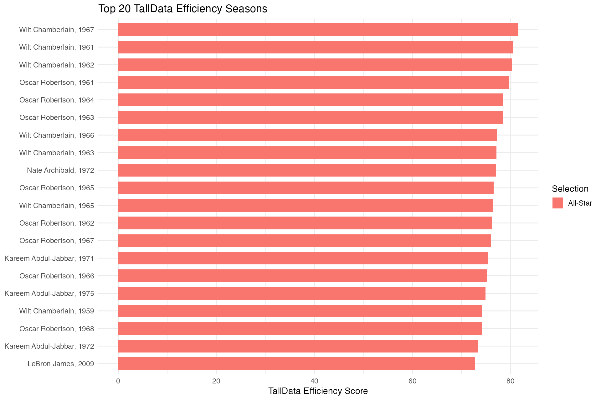
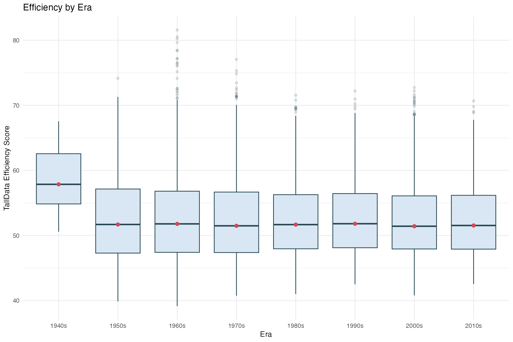
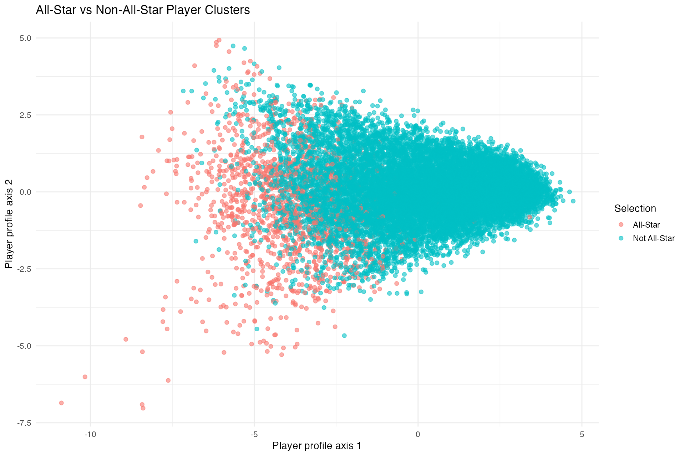
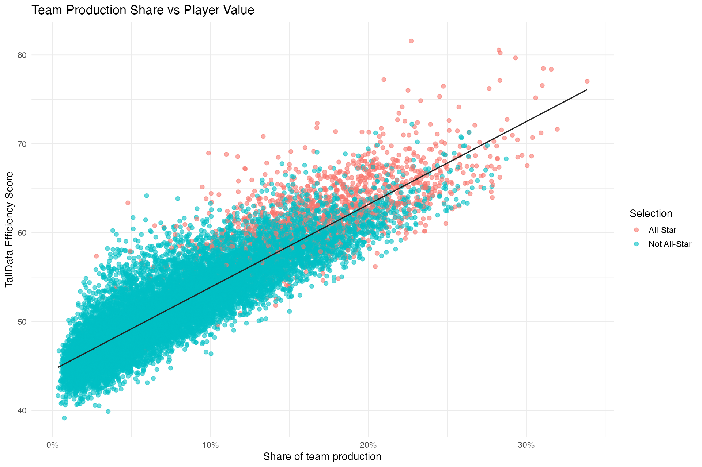
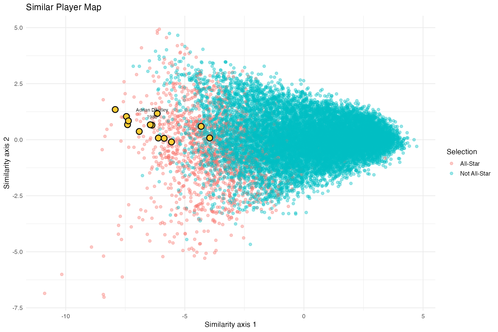

# NBA Legacy Lab

Can historical NBA data predict which players were truly valuable before the league recognized them?

NBA Legacy Lab is an R/Shiny product for exploring historical NBA player value, comparing eras, and predicting All-Star-level production. It turns historical box score data into a story-driven analytics app about recognition, value, and overlooked player seasons.

The core product question: can production, efficiency, team context, and prediction models identify players who looked like All-Stars or future Hall of Famers before the official honors caught up?

**Repo description:** R/Shiny sports analytics app for exploring historical NBA player value, comparing eras, and predicting All-Star-level production.

**Topics:** `r`, `nba`, `sports-analytics`, `shiny`, `data-visualization`

## Project Goals

- Build a clean historical NBA analytics dataset from player, team, playoff, award, Hall of Fame, and All-Star tables.
- Create a branded value metric that compares players within their own era.
- Predict All-Star selections from production, efficiency, minutes, and team-share signals.
- Surface high-value non-selections in a shareable "Who should have been an All-Star?" view.
- Package the analysis into NBA Legacy Lab, a Shiny app that feels like an interactive sports analytics product.

## Data

The repository includes two main data areas:

- `data/Stats_Extended_Before_2013/` contains CSV files for historical NBA player, team, coach, award, playoff, Hall of Fame, draft, and All-Star records.
- `data/Stats_Extended_2013_Beyond/` contains Excel files with player totals, per-game, per-36, per-100, and advanced statistics for 2013-14 and 2014-15.

Core historical files include:

- `basketball_master.csv`: player biographical/player key data
- `basketball_players.csv`: player season statistics
- `basketball_teams.csv`: team season statistics
- `basketball_awards_players.csv`: player award records
- `basketball_player_allstar.csv`: All-Star records
- `basketball_hof.csv`: Hall of Fame records
- `basketball_series_post.csv`: playoff series records

## TallData Efficiency Score

The project now includes a branded custom metric: **TallData Efficiency Score**.

The score is season-normalized so players are compared against their own league environment instead of only raw totals. It blends:

- Points per game
- Assists per game
- Rebounds per game
- Minutes per game
- True shooting percentage
- Team production share across points, assists, and shot attempts
- Turnovers per game as a penalty
- Field goal attempts per game as a shot-volume penalty

The Shiny app compares this score against All-Star selections and Hall of Fame outcomes to see where the numbers agree with history and where they challenge it.

## Key Questions

This project is designed to answer questions such as:

- Which player seasons looked valuable before the league officially recognized them?
- Can TallData Efficiency Score identify historically meaningful seasons from box score data?
- Which production signals best separate All-Star seasons from the rest of the league?
- Which non-All-Stars had the strongest statistical cases?
- How does era-normalized value compare with Hall of Fame outcomes?

## Current Analysis

The main exploratory script, `scripts/NBA_Pull.R`, loads historical tables, joins player and team season data, and focuses on a sample 2008 player dataset. Current analysis includes:

- Player/team joins using historical IDs
- All-Star flag enrichment
- Per-game statistics such as points, assists, turnovers, rebounds, and minutes
- Team-share statistics such as percentage of team points, field goal attempts, assists, and turnovers
- Efficiency experiments including assist-to-turnover ratio, points per field goal attempt, and points per 48 minutes
- Exploratory visualizations with `ggplot2`
- Correlation, covariance, pair plots, and principal component analysis
- Early classification experiments for All-Star prediction

`scripts/NBA_DB.R` shows an early path for loading the data into a local MySQL database. Early scratch work now lives in `notebooks/` so the project root stays focused.

## How To Run Locally

1. Clone the repository.

   ```bash
   git clone https://github.com/TallData/NBA-Stats.git
   cd NBA-Stats
   ```

2. Open R or RStudio from the project folder.

3. Install the core R packages used by the exploratory scripts.

   ```r
   source("requirements.R")
   ```

4. Run the main analysis script.

   ```r
   source("scripts/NBA_Pull.R")
   ```

5. Launch the Shiny app.

   ```r
   shiny::runApp("app")
   ```

6. Run the All-Star prediction model and export analysis tables.

   ```r
   source("scripts/all_star_model.R")
   ```

7. Export the core shareable charts.

   ```r
   source("scripts/export_visuals.R")
   ```

Note: some scripts reference older package versions, local paths, or a local MySQL setup. The current project is best treated as an exploratory analysis workspace while the data pipeline is modernized.

### Optional Database Setup

`scripts/NBA_DB.R` can write the loaded tables to a local MySQL database. Set credentials through environment variables instead of editing secrets into the script:

```bash
export DB_NAME="NBA"
export DB_USER="your_mysql_user"
export DB_PASSWORD="your_mysql_password"
export DB_HOST="localhost"
export DB_PORT="3306"
```

## Story Angles To Develop

The current analysis creates the foundation for shareable sports analytics stories like:

- The strongest statistical All-Star snubs by season
- Players whose value appeared in the data before awards or Hall of Fame recognition
- Seasons where team context may have hidden a player's production
- How traditional scoring leaders compare against TallData Efficiency Score
- Era-adjusted comparisons between recognized stars and overlooked contributors

## Screenshots

The app and export scripts produce shareable visual assets for the core story.

## Demo


### Top 20 Efficiency Seasons



### Efficiency By Era



### All-Star Vs Non-All-Star Clusters



### Team Production Share



### Similar Player Map



Core chart exports now live in `outputs/charts/`:

- `top_20_efficiency_seasons.png`
- `efficiency_by_era.png`
- `all_star_vs_non_all_star_clusters.png`
- `team_production_share.png`
- `similar_player_map.png`

## Shiny App

The main app experience is **NBA Legacy Lab** in `app/app.R`. It lets users:

- Filter historical player seasons by year, conference, games played, and minutes per game
- Rank player seasons by simple efficiency, scoring, true shooting, assist-to-turnover ratio, and team point share
- Rank and compare seasons using TallData Efficiency Score
- Compare TallData Efficiency Score against All-Star and Hall of Fame outcomes
- Explore five shareable visual stories: top efficiency seasons, efficiency by era, player clusters, team production share, and similar player map
- Review All-Star predictor results, confusion matrices, and top prediction misses
- Find high-probability non-selections in the "Who should have been an All-Star?" view
- Highlight one player across the league view
- Review a selected player's career value trend

Product positioning:

- **Explore legacy:** browse historical player seasons through era-adjusted value metrics
- **Compare eras:** see how player profiles shift across decades
- **Predict recognition:** model All-Star-level production and surface overlooked seasons

## Predictive Modeling

`scripts/all_star_model.R` trains a reproducible All-Star prediction workflow using a 70/30 train/test split.

Current model outputs include:

- Logistic regression predictions
- Optional random forest predictions when the `randomForest` package is installed
- Confusion matrix exports
- Top prediction misses
- A ranked `should_have_been_all_stars.csv` table for high-probability non-selections

Generated model outputs are written to `outputs/`.

## GitHub Project Polish

- License: MIT
- Suggested topics: `r`, `nba`, `sports-analytics`, `shiny`, `data-visualization`
- Issue templates: `.github/ISSUE_TEMPLATE/`
- Starter roadmap issues: `.github/ROADMAP_ISSUES.md`

## Roadmap

- Clean and standardize the data loading process
- Move repeated calculations into reusable R functions
- Add a project data dictionary
- Create reproducible notebooks or reports for core analyses
- Build a simple Shiny dashboard for interactive exploration
- Add polished charts and screenshots
- Document data sources and assumptions in more detail
- Add tests or validation checks for derived metrics

## Repository Structure

```text
.
├── .github/
│   ├── ISSUE_TEMPLATE/
│   └── ROADMAP_ISSUES.md
├── LICENSE
├── app/
│   └── app.R
├── data/
│   ├── Stats_Extended_Before_2013/
│   └── Stats_Extended_2013_Beyond/
├── notebooks/
│   ├── graphic test.R
│   └── sandbox.R
├── outputs/
│   ├── demo.gif
│   ├── charts/
│   │   ├── all_star_vs_non_all_star_clusters.png
│   │   ├── efficiency_by_era.png
│   │   ├── similar_player_map.png
│   │   ├── team_production_share.png
│   │   └── top_20_efficiency_seasons.png
│   ├── logistic_confusion_matrix.csv
│   ├── should_have_been_all_stars.csv
│   └── top_prediction_misses.csv
├── scripts/
│   ├── all_star_model.R
│   ├── export_visuals.R
│   ├── NBA_DB.R
│   └── NBA_Pull.R
├── requirements.R
└── README.md
```

## Status

This is now an early-stage sports analytics product with a clear hook: NBA Legacy Lab helps users explore which players' value may have appeared in the data before it appeared in the official record.
